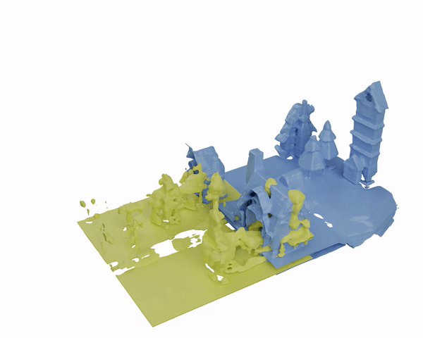
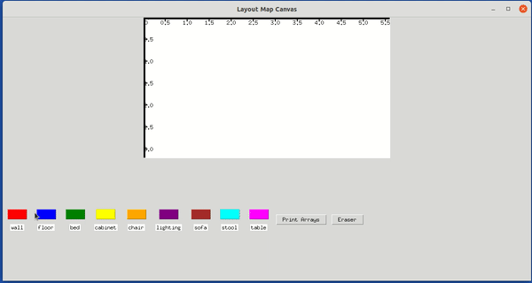

# BlockFusion: Expandable 3D Scene Generation using Latent Tri-plane Extrapolation 

### ACM Transactions on Graphics (SIGGRAPH'24)

### [Project page](https://yang-l1.github.io/blockfusion/) | [Paper](https://arxiv.org/abs/2401.17053) | [Video](https://www.youtube.com/watch?v=PxIBtd6G0mA) 

This repo contains the official implementation for the paper "BlockFusion: Expandable 3D Scene Generation using Latent Tri-plane Extrapolation".




### Installation
[Pytorch3d](https://github.com/facebookresearch/pytorch3d) is required for postprocess. Come to offical page for installation instructions.

We modified [diffusers](https://github.com/huggingface/diffusers) to adapt triplane structure. Users should build based on the ```./src```
```
# clone this repo 
python setup.py install
```
We provide the pretrained checkpoint for VAE, conditioned and unconditioned diffusion model, MLP [here](). Download and unzip them under ```./checkpoints```


### Pretrained model
Pretrained weights of MLP, VAE, and Diffuser(Condition/Unconditioned). [Download the model here [10GB]](https://drive.google.com/file/d/19cuQihXzxq9fcM_drMWMhmwHBdT3B8fA/view?usp=sharing)
and extract to ```./checkpoints```.


### Inference


To do uncondtional inference, run 
```
python unconditioned_prediction.py --batch 4 --save output/uncond
```


To do single block conditional inference, run 

```
python conditioned_prediction.py --layout samplelayouts/exp1_32-56-24/0_0.npy --save output/cond
```

We provide some sample layouts for demo. If you would like to draw your own layout maps, you can use ```drawtkinter.py``` to create your own layout. Here is a tutorial:



The unit of the graduations are in meters, furnitures need to be in reasonable scale. Walls should surround the floor and furniture should be placed on the floor.

The output layouts directory named after ```expname_xscale-zscale-stride```, xscale-zscale-stride are given in decimeter.

Usage:
```
python drawtkinter.py --h 56 --w 56 --expname draw
```

Full pipeline(conditional prediction + extrapolation + resample) is contained in ```fullpipeline.py```. Before running, specifying the layout directory.


```
python fullpipeline.py --layout samplelayouts/exp2_32-56-24 --resample 15 --save output
```


## Citation

If you find our code or paper helps, please consider citing:
```
@article{blockfusion,
  title={BlockFusion: Expandable 3D Scene Generation using Latent Tri-plane Extrapolation},
  author={Wu, Zhennan and Li, Yang and Yan, Han and Shang, Taizhang and Sun, Weixuan and Wang, Senbo and Cui, Ruikai and Liu, Weizhe and Sato, Hiroyuki and Li, Hongdong and Ji, Pan},
  journal={ACM Transactions on Graphics},
  volume={43},
  number={4},
  year={2024},
  doi={10.1145/3658188}
 }      
```
            
